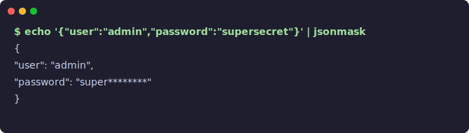

<p align="center">
  <h1>jsonmask</h1>
  <p>Pipe JSON through it. Secrets get masked. Nothing leaks.</p>
  <a href="https://www.npmjs.com/package/jsonmask"></a>
  <a href="LICENSE"></a>
</p>

<p align="center">
  
</p>

---

## Use cases

- Debug logging without leaking tokens
- Sharing API responses with colleagues
- CI pipelines that dump JSON
- Any `curl | jsonmask` situation

---

## Quick start

```bash
# Basic usage
echo '{"user":"admin","password":"supersecret"}' | npx jsonmask

# Mask everything
kubectl get secrets -o json | npx jsonmask -f all

# Custom fields
cat response.json | npx jsonmask -f ssn,credit_card,api_key

# Custom mask character
echo '{"token":"abc123"}' | npx jsonmask -c █
```

---

## Install

```bash
# No install needed
npx jsonmask --help

# Or globally
npm install -g jsonmask
```

---

## Options

| Flag | Description | Default |
|------|-------------|---------|
| `-f, --fields` | Fields to mask (comma-separated or `all`) | built-in list |
| `-i, --file` | Read from file | stdin |
| `-c, --char` | Mask character | `*` |
| `-l, --list` | Show default sensitive fields | |
| `-h, --help` | Show help | |

Runs with 20+ built-in field names: `password`, `secret`, `token`, `api_key`, `jwt`, `session`, `cookie`, `ssn`, `credit_card` and more.

---

## License

MIT
